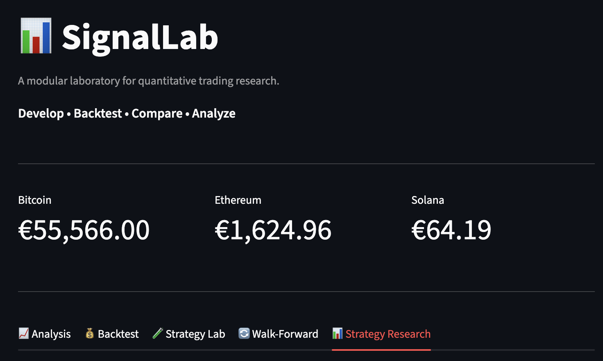
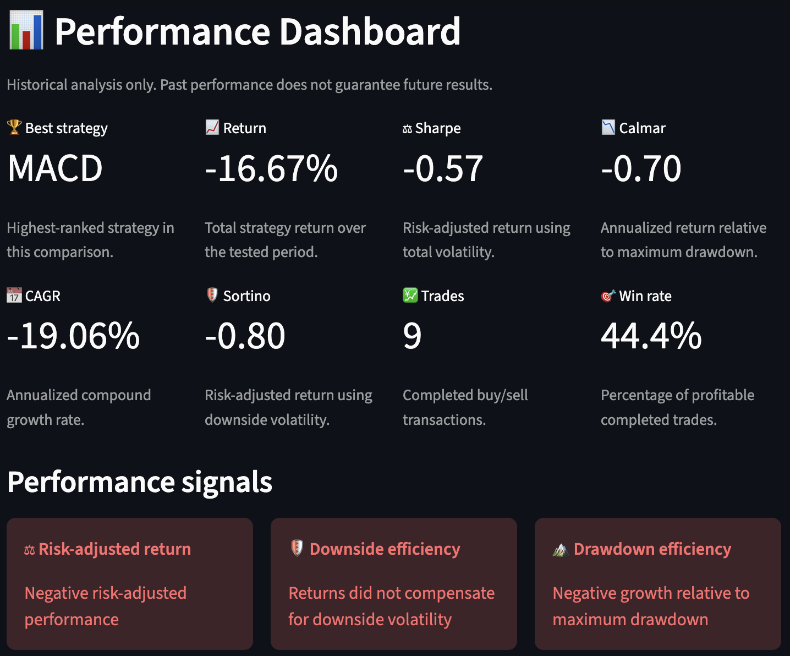
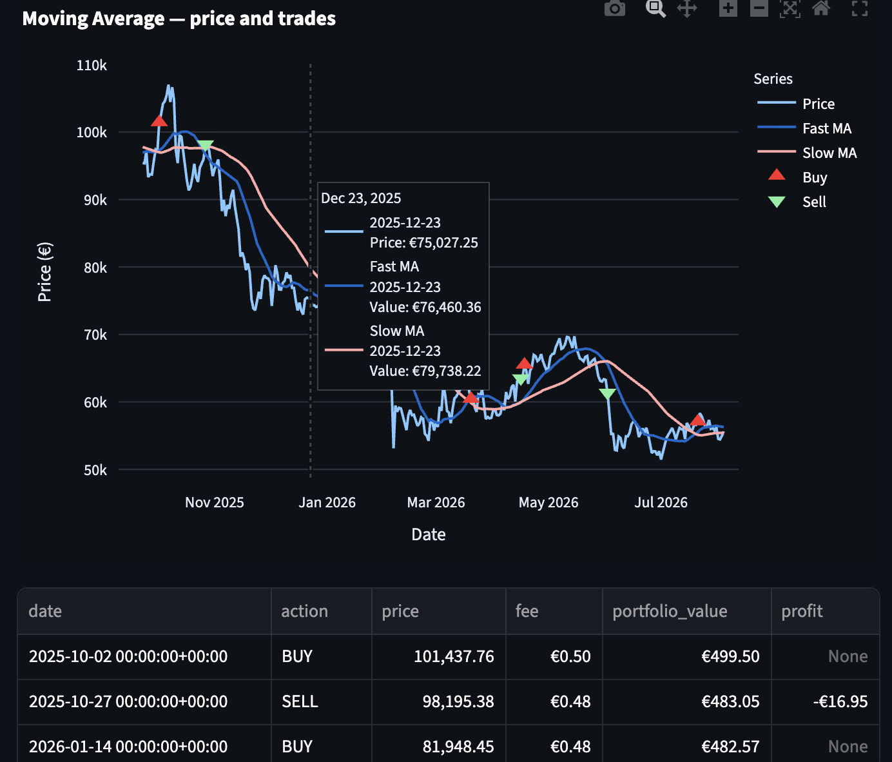
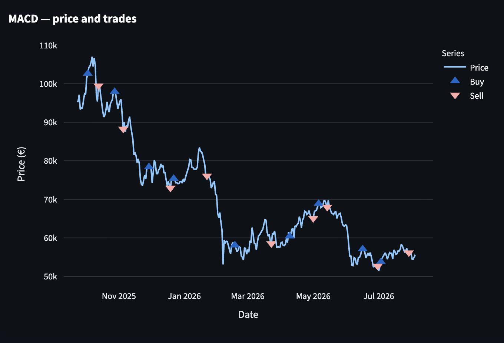
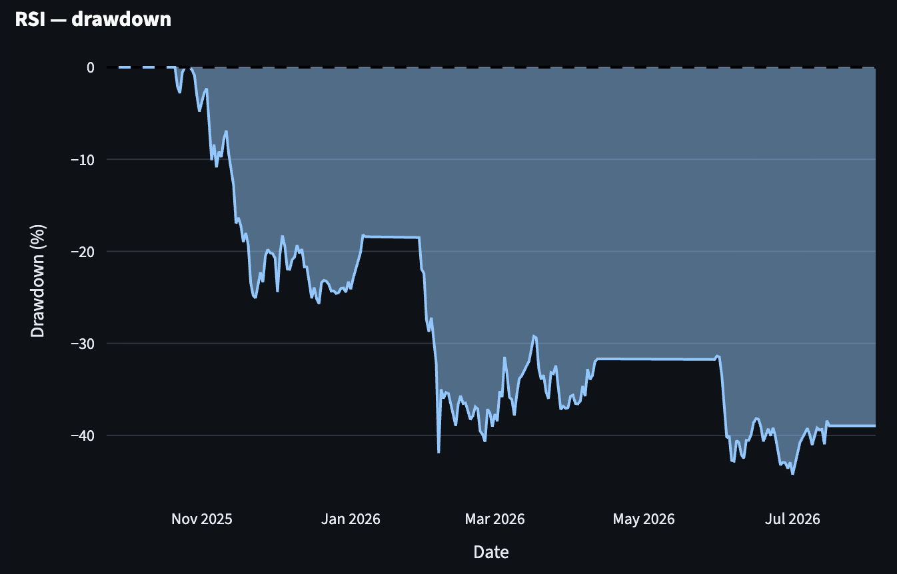
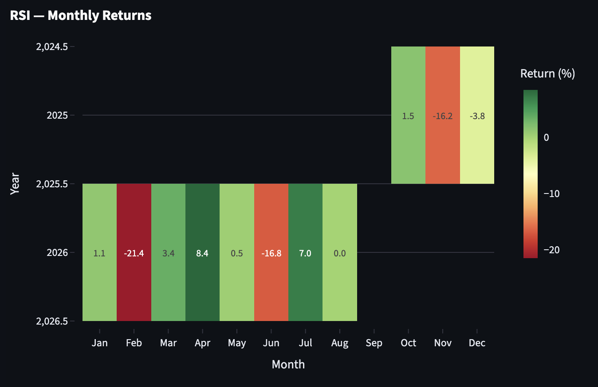

# 📊 SignalLab

> **A modular laboratory for quantitative trading research.**


**Develop • Backtest • Compare • Analyze**



---

## ✨ Features

SignalLab is a modular research platform for developing, testing and evaluating quantitative trading strategies.

### 📈 Strategy Analysis
- Interactive market data analysis
- Technical indicators
- Strategy signal visualization

### 💰 Backtesting
- Generic backtesting engine
- Transaction fee simulation
- Trade history
- Portfolio equity tracking

### 🧪 Strategy Lab
- Parameter experimentation
- Modular strategy registry
- Rapid strategy evaluation

### 🔄 Walk-Forward Validation
- Out-of-sample testing
- Rolling evaluation windows
- Strategy robustness assessment

### 📊 Strategy Research
- Performance dashboard
- Strategy comparison
- Equity curve comparison
- Drawdown analysis
- Rolling Sharpe Ratio
- Monthly Returns Heatmap
- Performance highlights
- Risk metrics (Sharpe, Sortino, Calmar, CAGR)

---

# 📸 Screenshots

## Strategy Research Dashboard



---

## Equity Curve Comparison



---

## Price & Executed Trades



---

## Drawdown Analysis



---

## Monthly Returns Heatmap



---

# 🏗 Architecture

SignalLab follows a modular architecture where each component has a clearly defined responsibility.

```text
app.py
│
├── analytics/
│   ├── performance.py
│   ├── drawdown.py
│   ├── rolling.py
│   └── monthly_returns.py
│
├── strategies/
│
├── simulator/
│
├── ui/
│   ├── charts.py
│   ├── formatting.py
│   ├── performance_dashboard.py
│   └── performance_highlights.py
│
└── tests/
```

---

# 🚀 Getting Started

Clone the repository

```bash
git clone https://github.com/<your-username>/SignalLab.git
cd SignalLab
```

Create a virtual environment

```bash
python -m venv .venv
```

Activate it

**macOS / Linux**

```bash
source .venv/bin/activate
```

**Windows**

```powershell
.venv\Scripts\activate
```

Install dependencies

```bash
pip install -r requirements.txt
```

Run SignalLab

```bash
streamlit run app.py
```

---

# 🧪 Running Tests

Run all tests

```bash
pytest
```

Run with verbose output

```bash
pytest -v
```

---

# 🛣 Roadmap

### ✅ Completed

- Modular strategy framework
- Generic backtesting engine
- Strategy registry
- Walk-forward validation
- Performance dashboard
- Strategy comparison
- Drawdown analytics
- Rolling Sharpe Ratio
- Monthly Returns Heatmap
- Performance highlights
- Reusable UI formatting

### 🔮 Future

- Multi-asset support
- Additional strategy library
- Portfolio optimization
- Monte Carlo analysis
- Position sizing models
- Performance report export
- Interactive strategy builder

---

# 🤝 Contributing

Ideas, suggestions and pull requests are always welcome.

---

# 📄 License

MIT License